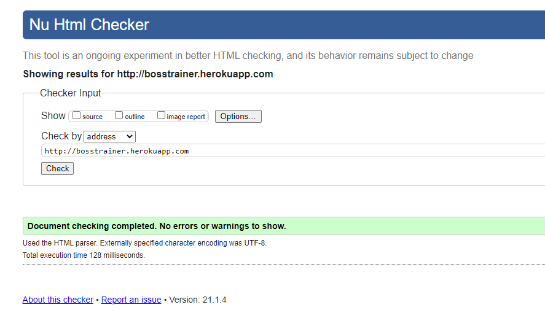
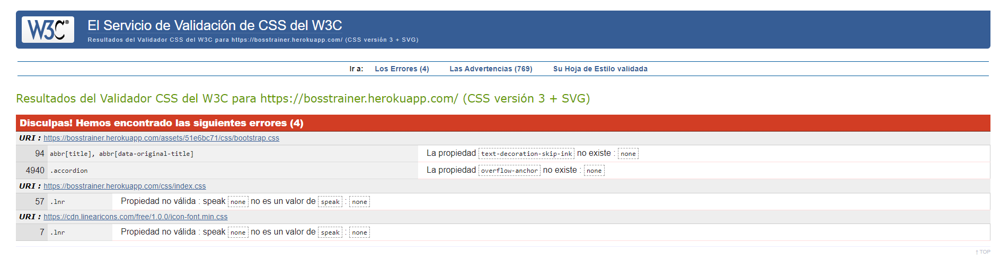
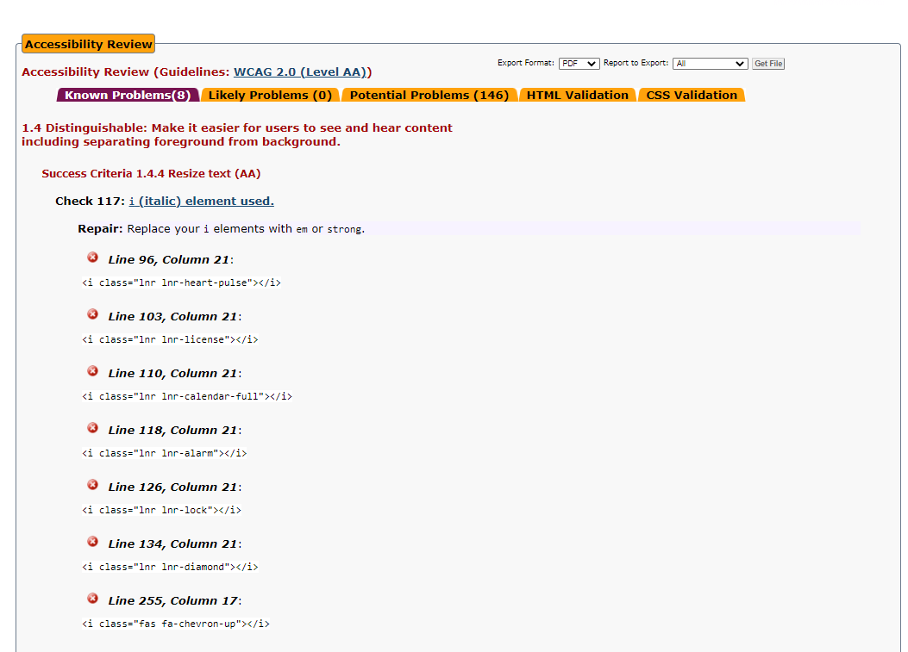
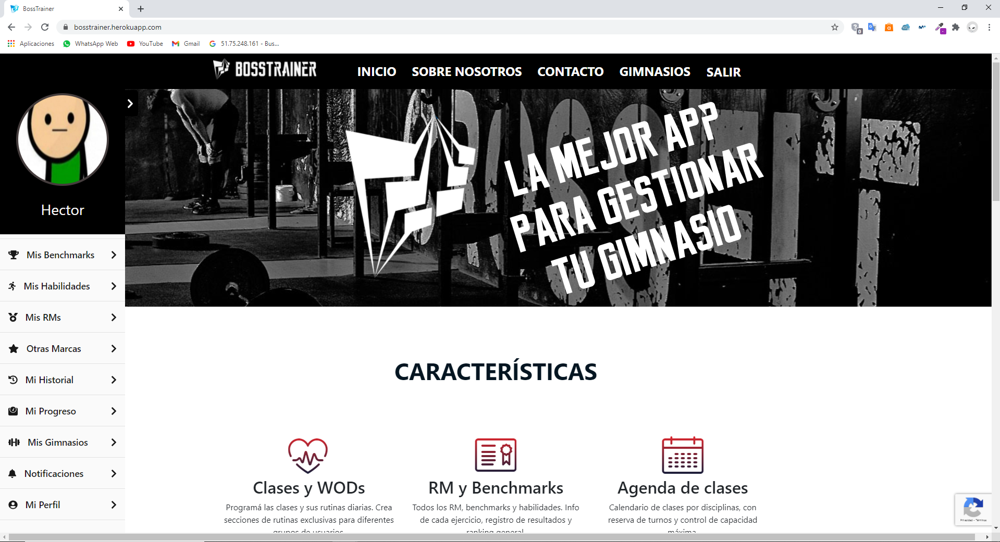
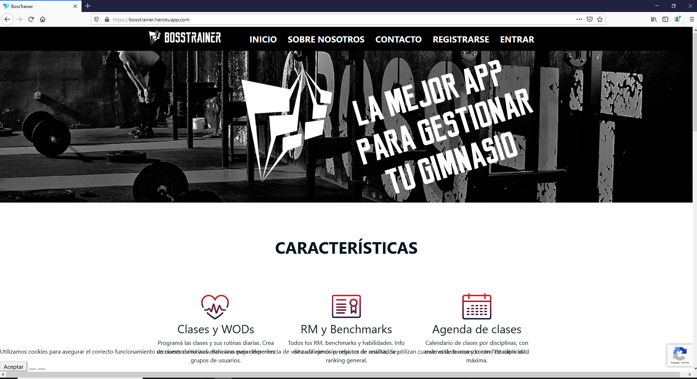
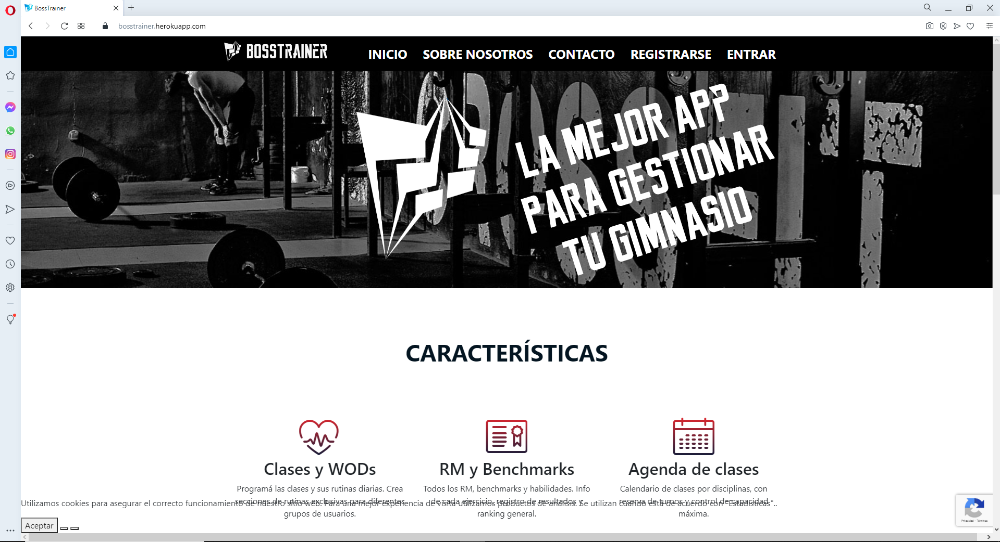
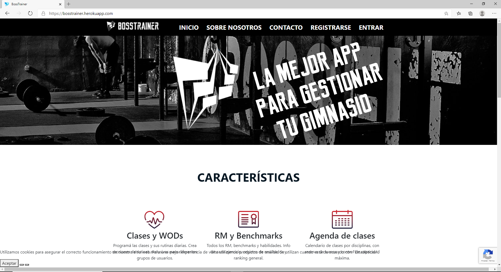

# Anexos

### **(R68) Validación de HTML y CSS, nivel de accesibilidad AA y prueba del seis**
---
### Validación de HTML y CSS

**HTML**

[Enlace a la validación HTML](https://validator.w3.org/nu/?doc=http%3A%2F%2Fbosstrainer.herokuapp.com)

**CSS**

Los siguientes errores son generados por los assets de boostrap y de linear-icons en mis css no se encuentran errores.

[Enlace a la validación CSS](https://jigsaw.w3.org/css-validator/validator?uri=https%3A%2F%2Fbosstrainer.herokuapp.com%2F&profile=css3svg&usermedium=all&warning=1&vextwarning=&lang=es)

---

### Validación de accesibilidad

La página index cumple el nivel AA de accesibilidad, el error que presenta es por usar iconos de linear-icons.

[Enlace a la validación accesibilidad](https://achecker.ca/checker/index.php)

---

### Prueba del seis

 1. ¿Qué sitio es éste?
- La aplicación tiene en todo momento elementos indicativos de que sitio es. arriba en la menú de navegación está en todo momento el logotipo de la aplicación. Abajo en el pié de página, esta también el nombre de la web. El menú de navegación y el pié de página se mantienen siempre, por lo que siempre está identificado el sitio.

 2. ¿En qué página estoy?
- Todas las páginas del sitio están identificadas por un titulo en grande que indica donde estoy en todo momento.

 3. ¿Cuales son las principales secciones del sitio?
- Las principales secciones del sitio son *MIS BENCHMARKS*, *MIS HABILIDADES*, *MIS RMS*, *OTRAS MARCAS*, *MI HISTORIAL*, *MI PROGRESO*, *MIS GIMNASIOS*, *NOTIFICACIONES* y *MI PERFIL* (algunas secciones solo serán visibles si estamos logueados en la aplicación).

 4. ¿Qué opciones tengo en este nivel?
- Aparte de las secciones descritas antes, en la barra de navegación hay varias secciones, *SALIR*, *GIMNASIOS*, *CONTACTO*, *SOBRE NOSOTROS* y *INICIO* Cada una te lleva a un apartado distinto de la aplicacion.

 5. ¿Dónde estoy en el esquema de las cosas?
- En todas las páginas existe en la zona superior un título indicando donde me encuentro.

 6. ¿Cómo busco algo?
- En la seccion de *GIMNASIOS* y en la de *MIS GIMNASIOS * disponemos de un buscador específico para esa sección. No existe un buscador genérico debido a la naturaleza de la propia aplicación.

---

### **(R70) Comprobación en varios navegadores**

#### **Google Chrome**

---

#### **Mozilla Firefox**

---

#### **Opera**

---

#### **Microsoft Edge**

---

### **(R61) Pruebas funcionales con Codeception**

---