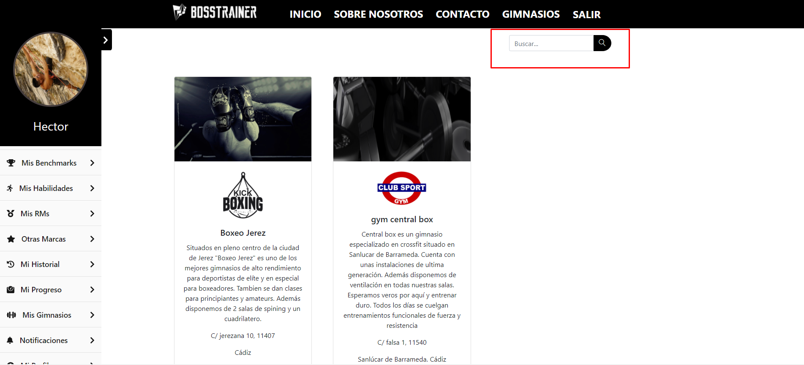
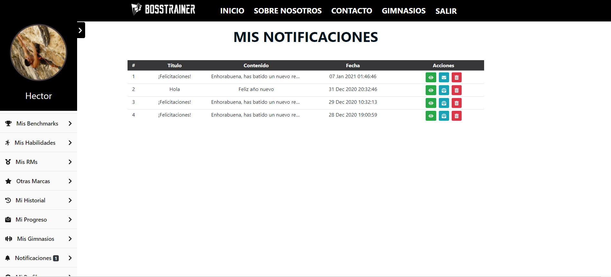
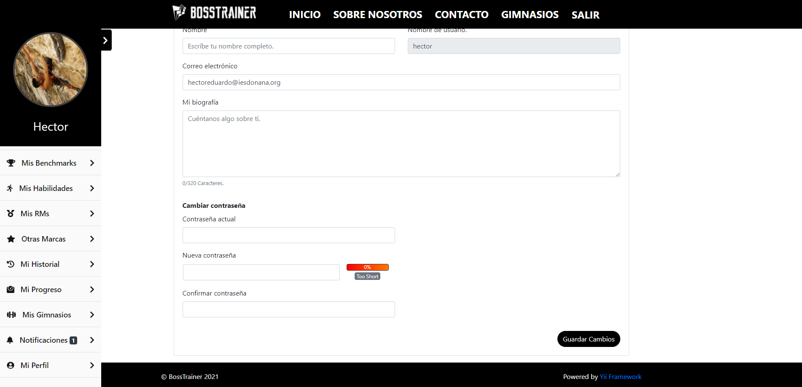
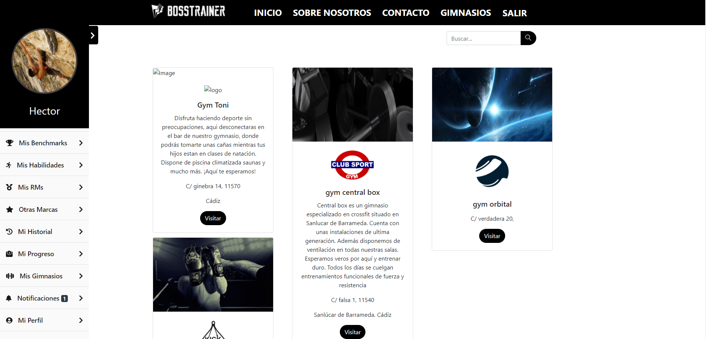
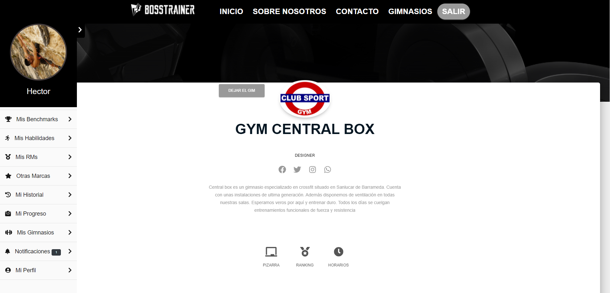
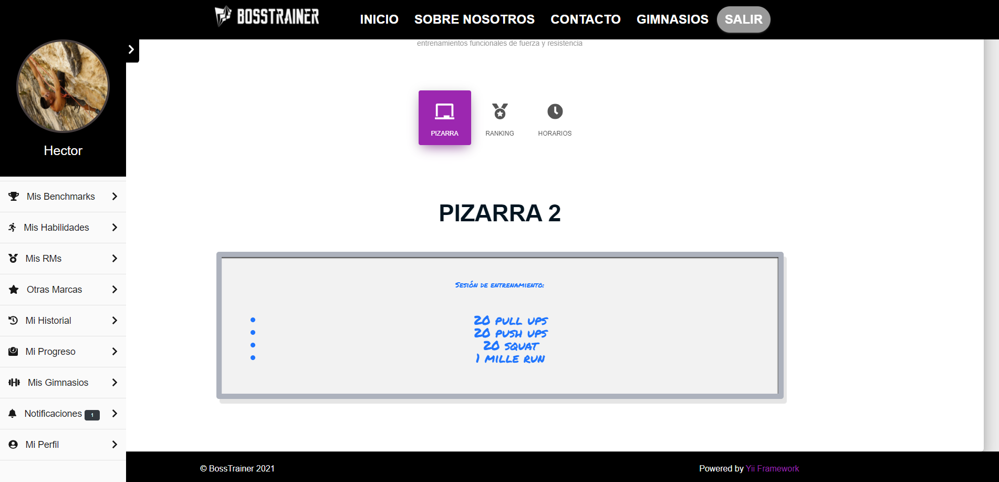
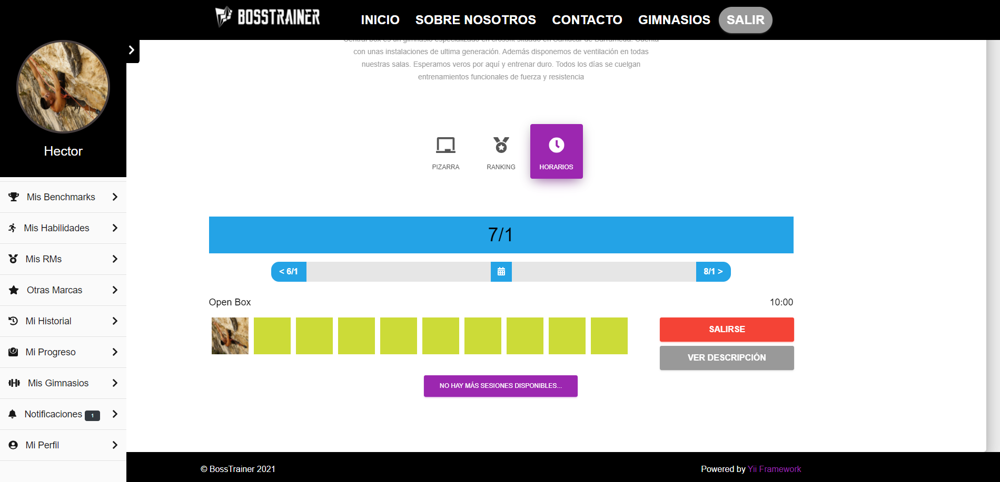

# Manual de usuario

## Parte pública

### Página de inicio sin loguearse

En la página de inicio antes de loguearnos podemos acceder a un formulario de contacto si deseamos información sobre el producto, además tenemos los típicos botones para ***Entrar*** o ***Registrarse*** en caso de que aún no lo estemos.

En el cuerpo podemos encontrar información básica de lo que ofrece la aplicacion, además de ciertas imágenes y esloganes atractivos que van con la temática. 

---

### Página de login

En esta página podemos encontrar el logotipo de la web y un formulario de inicio de sesión.

Además está disponible las opciones **Restaurar contraseña** y **reenviar correo de confirmación** que abrirán en ventanas modales un pequeño formulario donde deberemos de introducir la contraseña válida.

---

### Página de Registro

Esta es la página tenemos acceso a un pequeño formulario de registro que nos permitirá crearnos una cuenta de usuario para acceder a la aplicación

En la parte inferior del formulario un mensaje informativo nos indicará los pasos a seguir si queremos registrarnos como gimnasio.

---

### Una vez iniciada sesión

Una vez registrados nos aparecerá una barra de navegación en la parte izquierda que podremos ocultar en la que estarán los enlaces a las distintas partes de la aplicación.

Ademas de nuestra foto de perfil y nuestro nombre de usuario.

---

### Mis benchmarks

En esta parte de la aplicación nos encontraremos un listado de los diferentes programas de ejercicios o wods que se han implementados dentro de la aplicación y que están clasificados como benchmarks.

Aquí el usuario podrá añadir, modificar y eliminar sus estadísticas que serán almacenadas en la base de datos y que se compartirán con el resto de usuarios.

Cada ejercicio tiene una descripción (y un enlace a un video), que aparecerá en una ventana modal cuando el usuario haga click en el nombre.

---

### Mis Habilidades

En esta parte de la aplicación nos encontraremos un listado de los diferentes ejercicios o movimientos implementados dentro de la aplicación y que están clasificados como habilidades.

Aquí el usuario podrá añadir, modificar y eliminar sus estadísticas que serán almacenadas en la base de datos y que se compartirán con el resto de usuarios.

Cada ejercicio tiene una descripción que aparecerá en una ventana modal cuando el usuario haga click en el nombre.

---

### Mis RMS

En esta parte de la aplicación nos encontraremos un listado de los diferentes ejercicios o movimientos implementados dentro de la aplicación y que están clasificados como Rms.

El usuario deberá introducir la cantidad de carga que puede levantar haciendo el ejercicio correctamente una sola vez.

Aquí el usuario podrá añadir, modificar y eliminar sus estadísticas que serán almacenadas en la base de datos y que se compartirán con el resto de usuarios.

---

### Mis otras marcas

En esta parte de la aplicación nos encontraremos un listado de los diferentes hitos implementados dentro de la aplicación y que están clasificados como otras marcas.

El usuario deberá introducir el tiempo que tarda en completar el hito.

Aquí el usuario podrá añadir, modificar y eliminar sus estadísticas que serán almacenadas en la base de datos y que se compartirán con el resto de usuarios.

---

### Mi historial

En esta parte de la aplicación nos encontraremos un listado de las diferentes sesiones de entrenamiento en las que el usuario ha participado.

El usuario tiene la opción de valorar la sesión además cada sesión cuenta con un enlace al gimnasio a la que pertenece. 

---

### Mi progreso

En esta parte de la aplicación nos encontraremos una gráfica en la que de un vistazo mostrará en orden cronológico los progresos que el usuario vaya realizando en cuanto a peso corporal se trata.

Esta gráfica cuenta con la opción de exportar los datos a pdf o a png, jpg o vector de imágenes svg. Además podremos incluso imprimirla.

En la sección intermedia contamos con otra tabla que facilitará al usuario la visualización de los datos y cuenta con la opción de eliminar los registros si el usuario lo desea.

En la parte superior izquierda hay un botón para añadir registros a nuestra tabla.

---

### Mis gimnasios

En esta parte de la aplicación el usuario verá las tarjetas de presentación de los gimnasios a los cuales él sigue. 

Además en la parte superior derecha hay una barra de busqueda, el usuario podrá buscar por cualquier palabra y el buscador será el encargado de devolver las coincidencias.

---

### Notificaciones

Aquí el usuario podrá ver de un vistazo general las notificaciones recibidas, aparecerá ordenadas en una tabla de la más reciente a la más antigua.

Si se observa bien en la parte derecha donde pone acciones el usuario dispondrá de 3 botones de acciones:

- **Ver** En ``verde`` y con el icono de un ojo. este botón redireccionará al usuario a una vista donde podrá ver los detalles de la notificación así como de su contenido completo.

- **Marcar como leído** En ``azul`` y con el icono de un sobre. Mostrará el estado de la notificacion si está leida (sobre abierto) o no (sobre cerrado). En cualquier caso pulsando el botón podremos cambiar el estado.

- **Borrar** En ``rojo`` y con el icono de una papelera. Sirve para borrar la notificación.

Además en la barra de navegación lateral, encontraremos un número al lado del enlace de notificaciones. Este número indica la cantidad de notificaciones sin leer que el usuario tiene actualmente.

---

### Mi perfil

En esta página podremos configurar todo lo relacionado con la cuenta del usuario:
1. **Avatar**
- Con el boton cambiar foto el usuario podrá cambiar su imagen de perfil.
2. **Datos del usuario**
- Todos los datos referentes al perfil del usuario podrán cambiarse en esta sección a excepción del nombre de usuario.
3. **Cambiar contraseña**
- Aquí se podrá cambiar la contraseña de acceso a la aplicación. Por seguridad se pedirá la contraseña antigua y por duplicado la nueva.

---

### Gimnasios

Esta sección es el padre de la sección mis gimnasios, aquí aparecerán todas las cartas de presentación de los gimnasios de nuestra base de datos en un scroll infinito. 

En la parte superior derecha el usuario dispondrá de una barra de búsqueda que le ayudará encontrar el gimnasio que desea. (Se recuerda que puede buscar por cualquier palabra y se mostrará las coincidencias.)

---

### Perfil gimnasio

Esta es la pagina principal de cada gimnasio, que está personalizada según la configuración que hayan elegido los gimnasios.

En la parte central podemos encontrar una imagen del logo del gimnasio en cuestión. Junto a este en la parte izquierda el usuario tendrá a su disposición un botón para seguir a ese gimnasio.

Una vez el usuario siga al gimnasio, este podrá activar los servicios que haya contratado previamente.

Además en la parte inferior del perfil del gimnasio podemos encontrar 3 pestañas: ``Pizarra``, ``Records`` y ``Horarios``.

- La pizarra mostrará una pizarra por defecto que el gimnasio haya creado y decidido colocar. 

- Horarios mostrará una lista de todas las clases disponibles para ese día.

En la parte superior se encuentra tres botones que ayudará al usuario a navegar y seleccionar el dia que desea entrenar.

Una vez decidido en que sesión de entrenamiento desea participar solo tendrá que hacer click en el botón unirse. Y si esta al corriente en los pagos o su tarifa se lo permite podrá entrenar en esa clase. Una vez hecho esto tendrá la opción de salirse cuando quiera.

*El numero de recuadros significa la cantidad de plazas disponibles para esa sesión.

En el caso de que una sesión estuviera llena el usuario tendría la opción de entrar en lista de espera. Esta opción habilitará notificaciones para el usuario en el caso de que una plaza quede libre en la sesión de entrenamiento.

---