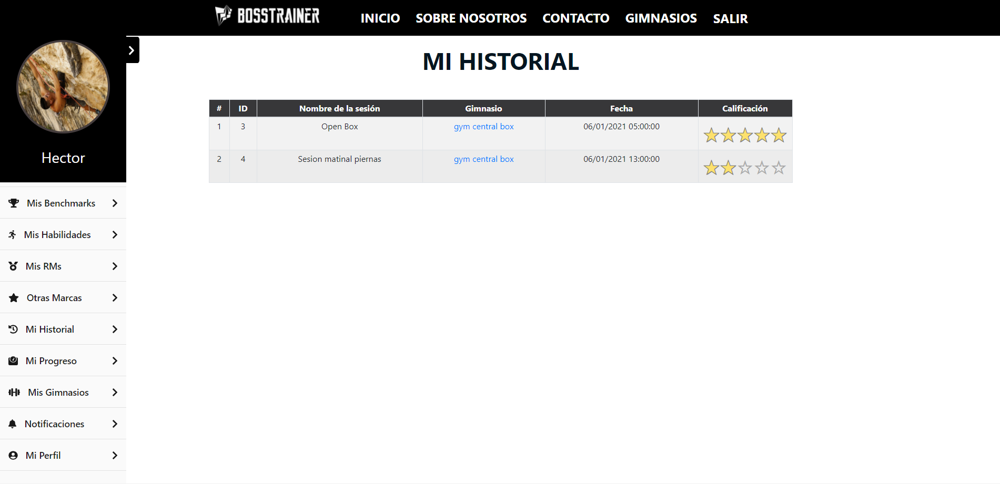

# Manual de usuario

## Parte pública

### Página de inicio sin loguearse

En la página de inicio antes de loguearnos podemos acceder a un formulario de contacto si deseamos información sobre el producto, además tenemos los típicos botones para ***Entrar*** o ***Registrarse*** en caso de que aún no lo estemos.

En el cuerpo podemos encontrar información básica de lo que ofrece la aplicacion, además de ciertas imágenes y esloganes atractivos que van con la temática. 

---

### Página de login

En esta página podemos encontrar el logotipo de la web y un formulario de inicio de sesión.

Además está disponible las opciones **Restaurar contraseña** y **reenviar correo de confirmación** que abrirán en ventanas modales un pequeño formulario donde deberemos de introducir la contraseña válida.

---

### Página de Registro

Esta es la página tenemos acceso a un pequeño formulario de registro que nos permitirá crearnos una cuenta de usuario para acceder a la aplicación

En la parte inferior del formulario un mensaje informativo nos indicará los pasos a seguir si queremos registrarnos como gimnasio.

---

### Una vez iniciada sesión

Una vez registrados nos aparecerá una barra de navegación en la parte izquierda que podremos ocultar en la que estarán los enlaces a las distintas partes de la aplicación.

Ademas de nuestra foto de perfil y nuestro nombre de usuario.

---

### Mis benchmarks

En esta parte de la aplicación nos encontraremos un listado de los diferentes programas de ejercicios o wods que se han implementados dentro de la aplicación y que están clasificados como benchmarks.

Aquí el usuario podrá añadir, modificar y eliminar sus estadísticas que serán almacenadas en la base de datos y que se compartirán con el resto de usuarios.

Cada ejercicio tiene una descripción (y un enlace a un video), que aparecerá en una ventana modal cuando el usuario haga click en el nombre.

---

### Mis Habilidades

En esta parte de la aplicación nos encontraremos un listado de los diferentes ejercicios o movimientos implementados dentro de la aplicación y que están clasificados como habilidades.

Aquí el usuario podrá añadir, modificar y eliminar sus estadísticas que serán almacenadas en la base de datos y que se compartirán con el resto de usuarios.

Cada ejercicio tiene una descripción que aparecerá en una ventana modal cuando el usuario haga click en el nombre.

---

### Mis RMS

En esta parte de la aplicación nos encontraremos un listado de los diferentes ejercicios o movimientos implementados dentro de la aplicación y que están clasificados como Rms.

El usuario deberá introducir la cantidad de carga que puede levantar haciendo el ejercicio correctamente una sola vez.

Aquí el usuario podrá añadir, modificar y eliminar sus estadísticas que serán almacenadas en la base de datos y que se compartirán con el resto de usuarios.

---

### Mis otras marcas

En esta parte de la aplicación nos encontraremos un listado de los diferentes hitos implementados dentro de la aplicación y que están clasificados como otras marcas.

El usuario deberá introducir el tiempo que tarda en completar el hito.

Aquí el usuario podrá añadir, modificar y eliminar sus estadísticas que serán almacenadas en la base de datos y que se compartirán con el resto de usuarios.

---

### Mi historial

En esta parte de la aplicación nos encontraremos un listado de las diferentes sesiones de entrenamiento en las que el usuario ha participado.

El usuario tiene la opción de valorar la sesión además cada sesión cuenta con un enlace al gimnasio a la que pertenece. 

---

### Mi progreso

En esta parte de la aplicación nos encontraremos una gráfica en la que de un vistazo mostrará en orden cronológico los progresos que el usuario vaya realizando en cuanto a peso corporal se trata.

Esta gráfica cuenta con la opción de exportar los datos a pdf o a png, jpg o vector de imágenes svg. Además podremos incluso imprimirla.

En la sección intermedia contamos con otra tabla que facilitará al usuario la visualización de los datos y cuenta con la opción de eliminar los registros si el usuario lo desea.

En la parte superior izquierda hay un botón para añadir registros a nuestra tabla.

---

### Mi perfil

En esta página podremos configurar todo lo relacionado con la cuenta del usuario:
1. **Avatar**
- Aquí se eligirá la foto de perfil del usuario.
2. **Cambiar contraseña**
- Aquí se podrá cambiar la contraseña de acceso a la aplicación. Por seguridad se pedirá la contraseña antigua y por duplicado la nueva.

---